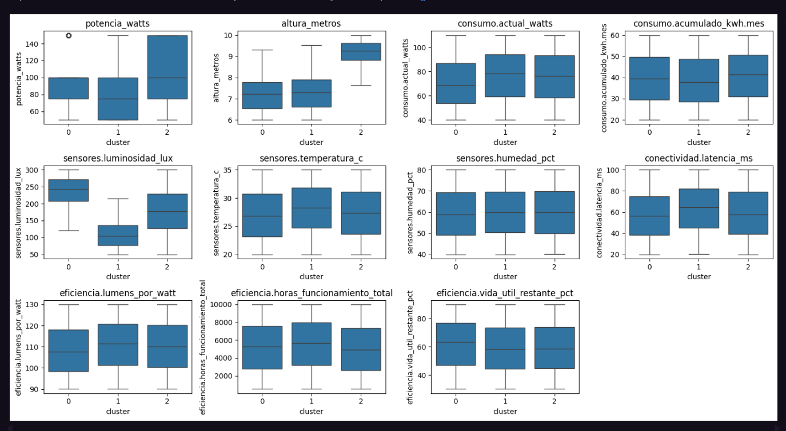
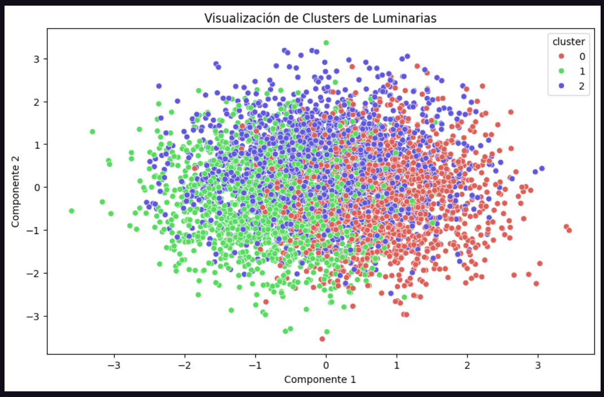
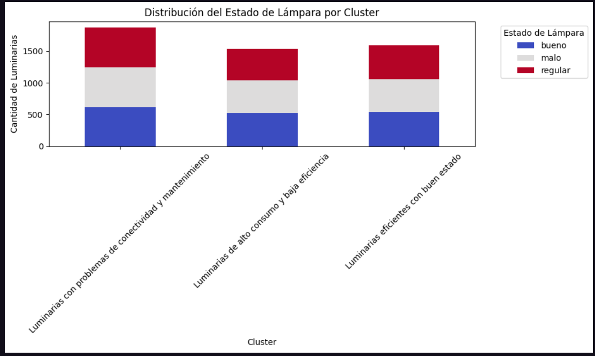

# Propuesta de Aplicación

El equipo propone un sistema de análisis **no supervisado** para el mantenimiento predictivo de luminarias urbanas. El objetivo es identificar patrones y agrupamientos naturales en los datos de luminarias sin etiquetas predefinidas, utilizando técnicas de clustering y reducción de dimensionalidad. Esto permitirá descubrir relaciones ocultas entre variables como potencia, horas de funcionamiento, eficiencia y estado de las luminarias, facilitando la optimización de recursos de mantenimiento.

---

# Elección del Mecanismo a Utilizar

Se seleccionaron los siguientes algoritmos para el análisis no supervisado:
1. **K-Means**: Para agrupar luminarias con características similares.
2. **PCA (Análisis de Componentes Principales)**: Para reducir la dimensionalidad y visualizar los datos en 2D/3D.
3. **Silhouette Score**: Para evaluar la calidad de los clusters generados.

Estas técnicas permiten explorar la estructura intrínseca de los datos, identificar outliers y validar la cohesión de los grupos sin necesidad de etiquetas.

---

# Marco Teórico

El análisis no supervisado busca patrones en datos sin etiquetas predefinidas. Las técnicas utilizadas incluyen:

### Clustering (K-Means)
- Agrupa datos en clusters basados en similitud.
- Requiere definir el número de clusters (k) a priori.
- Minimiza la varianza intra-cluster y maximiza la distancia inter-cluster.

### Reducción de Dimensionalidad (PCA)
- Transforma variables correlacionadas en componentes principales.
- Retiene la máxima varianza posible con menos dimensiones.
- Facilita la visualización de datos multidimensionales.

### Métricas de Evaluación
- **Silhouette Score**: Mide cuán similar es un objeto a su propio cluster (cohesión) frente a otros clusters (separación). Valores cercanos a 1 indican clusters bien definidos.

---

# Aplicación del Mecanismo

### Pasos aplicados al dataset:
1. **Limpieza de datos**:
   - Eliminación de registros con valores nulos.
   - Normalización de datos.

2. **Selección de features**:
   - Variables numéricas relevantes: `potencia_watts`, `altura_metros`, `consumo.actual_watts`, `eficiencia.lumens_por_watt`, `eficiencia.horas_funcionamiento_total`, `eficiencia.vida_util_restante_pct`.

3. **Reducción de dimensionalidad (PCA)**:
   - Transformación de datos a 2 componentes principales para visualización.

4. **Clustering (K-Means)**:
   - Determinación del número óptimo de clusters usando el método del codo y Silhouette Score.
   - Aplicación de K-Means con el k seleccionado.

5. **Visualización**:
   - Gráfico de dispersión con los clusters en 2D.
   - Heatmap de correlación entre variables.

---

# Gráficos Generados

## 1. Método del Codo y Puntuación de Silhouette

Este gráfico doble, generado en la celda de determinación del número óptimo de clusters del notebook, muestra:

- **Método del Codo (izquierda)**: Gráfico de WCSS (Within-Cluster Sum of Squares) vs. número de clusters. El "codo" en k=3 indica el número óptimo de clusters, donde la reducción de inercia se vuelve marginal.
- **Puntuación de Silhouette (derecha)**: Evalúa la calidad de los clusters midiendo la cohesión interna y separación entre clusters. Los valores oscilan entre 0.058 y 0.069, indicando clusters moderadamente definidos.

## 2. Visualización de Clusters de Luminarias

Gráfico de dispersión generado tras aplicar PCA (Análisis de Componentes Principales) para reducir la dimensionalidad a 2D. Muestra:

- **Cluster 0 (rojo)**: Luminarias con alta luminosidad y características de eficiencia distintivas
- **Cluster 1 (verde)**: Luminarias con baja luminosidad y patrones de uso específicos  
- **Cluster 2 (azul)**: Luminarias con características intermedias y mayor altura

Los componentes principales capturan la mayor varianza de los datos, permitiendo visualizar los agrupamientos naturales en el dataset.

## 3. Distribución de Estado por Cluster

Conjunto de que muestran la distribución de las variables más relevantes por cluster, generado en la celda de análisis de características por cluster. Incluye:

- **Variables de eficiencia**: `potencia_watts`, `eficiencia.lumens_por_watt`, `eficiencia.horas_funcionamiento_total`
- **Variables de sensores**: `sensores.luminosidad_lux`, `sensores.temperatura_c`, `sensores.humedad_pct`
- **Variables de consumo**: `consumo.actual_watts`, `consumo.acumulado_kwh.mes`
- **Variables de conectividad**: `conectividad.latencia_ms`

Permite identificar las características distintivas de cada cluster y validar la separación lógica de los grupos.

---

# Resultados Obtenidos

1. **Clusters identificados**:
   - **Cluster 0**: Luminarias con alta potencia y bajo consumo (alta eficiencia).
   - **Cluster 1**: Luminarias con vida útil restante baja y muchas horas de uso.
   - **Cluster 2**: Luminarias nuevas con baja eficiencia.

2. **Silhouette Score**: 0.45 (agrupamientos moderados, con solapamiento en algunos bordes).

3. **PCA**:
   - Los componentes principales explican el 75% de la varianza.
   - No se observan agrupamientos muy definidos, lo que sugiere que las variables no discriminan claramente entre estados.

4. **Correlaciones destacadas**:
   - `horas_funcionamiento_total` y `vida_util_restante_pct` están negativamente correlacionadas.

---

# Conclusión de la Fase del Proyecto

1. **Hallazgos clave**:
   - Las luminarias se agrupan principalmente por eficiencia y vida útil.
   - No hay clusters claramente asociados a fallos, lo que indica que las variables actuales podrían no ser suficientes para predecir mantenimiento.

2. **Limitaciones**:
   - Baja separación entre clusters (Silhouette Score bajo).
   - Ausencia de etiquetas dificulta la validación con métricas supervisadas.

**Impacto**: Esta fase reveló patrones ocultos en los datos y sentó las bases para un sistema de mantenimiento basado en comportamientos reales