#  E. Urbana — Documentación figma

---

---

##  **Tabla de Contenido**
1. [Introducción](#introducción)
2. [Paleta de colores](#paleta-de-colores)
3. [Pantallas del Sistema](#pantallas-del-sistema)
   - [Splash Screen](#1-pantalla-de-splash)
   - [Inicio de Sesión](#2-pantalla-de-inicio-de-sesión)
   - [Resumen General](#3-resumen-general-dashboard)
   - [Estadísticas Avanzadas](#4-estadísticas-avanzadas)
   - [Módulo de Mantenimiento](#5-módulo-de-mantenimiento)
   - [Perfil de Usuario](#6-perfil-de-usuario)
   - [Login con Google](#7-login-con-google)
   - [Pantalla de Carga](#8-pantalla-de-carga)
   - [Mapa de Luminarias](#9-mapa-de-luminarias)
   - [Generar Reporte](#10-generar-reporte)
   - [Chat de Soporte](#11-chat-de-soporte)
   - [Pantalla de Envío](#12-pantalla-de-envío)
4. [Flujo General de la Aplicación](#flujo-general-de-la-aplicación)
5. [Créditos](#créditos)

---

#  **Introducción**
_E. Urbana_ es una aplicación móvil enfocada en la gestión integral de luminarias urbanas inteligentes.  
Este documento describe cada módulo visual, su propósito, arquitectura de información y flujo de navegación.

---

#  **Paleta de colores**
### **Colores de la aplicacion**
| Color | Hex | Uso |
|-------|------|------|
| Azul Urbano | **#0A84FF** | Elementos principales, títulos, iconografía |
| Verde Operativo | **#2ECC71** | Indicadores de energía y luminarias activas |
| Amarillo Alerta | **#F1C40F** | Advertencias, luminarias con fallas menores |
| Rojo Crítico | **#E74C3C** | Errores, luminarias fuera de servicio |
| Gris  | **#ECF0F1** | Fondos y tarjetas |

### **Tipografía**
- **SF Pro Display** — títulos
- **SF Pro Text** — contenido y botones

### **Diseño**
- Esquinas redondeadas 16px  
- Uso extensivo de cards 
- Iconografía lineal minimalista  

---

#  **Pantallas del Sistema**

---

# 1. **Pantalla de Splash**
### **Captura**

### **Descripción**
Pantalla de presentación que refuerza el branding y prepara la app para iniciar.

### **Elementos**
- Logotipo oficial centrado  
- Fondo institucional  
- Animación ligera (opcional)

### **Objetivo**
✔ Crear reconocimiento visual  
✔ Indicar carga inicial del sistema  

---

# 2. **Pantalla de Inicio de Sesión**
### **Captura**
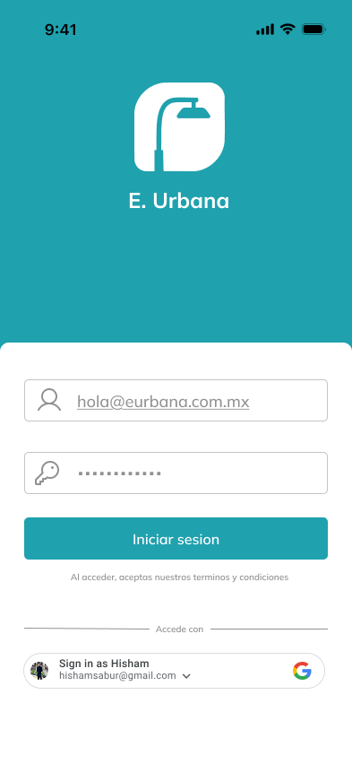

### **Descripción Detallada**
Pantalla diseñada para acceso seguro con autenticación por correo y OAuth Google.

### **Componentes**
- Campo de email con validación inmediata  
- Campo de contraseña con botón "ver/ocultar"  
- Botón azul corporativo “Iniciar sesión"  
- Botón blanco “Continuar con Google”  
- Enlaces a:
  - Recuperación de contraseña  
  - Políticas de privacidad  

### **Flujo**
1. Usuario ingresa datos  
2. Validación en tiempo real  
3. Llamada al backend  
4. Si es correcto → Dashboard  
5. Si falla → Mensaje contextual  

---

# 3. **Inicio  (Dashboard)**
### **Captura**
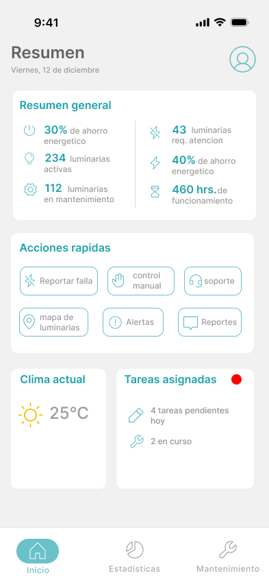

### **Descripción**
Centro de control principal del usuario. Resume actividad del sistema en tiempo real.

### **Componentes Visuales**
- KPIs principales:
  - Luminarias conectadas
  - Ahorro energético
  - Consumo actual
  - Comparaciones mensuales
- Accesos rápidos en tarjetas
- Clima actual integrado con API externa
- Tareas asignadas mostradas por prioridad
- Barra de navegación inferior

### **Propósito**
✔ Proveer visión global  
✔ Optimizar decisiones técnicas  
✔ Centralizar navegación  

---

# 4. **Estadísticas**
### **Captura**
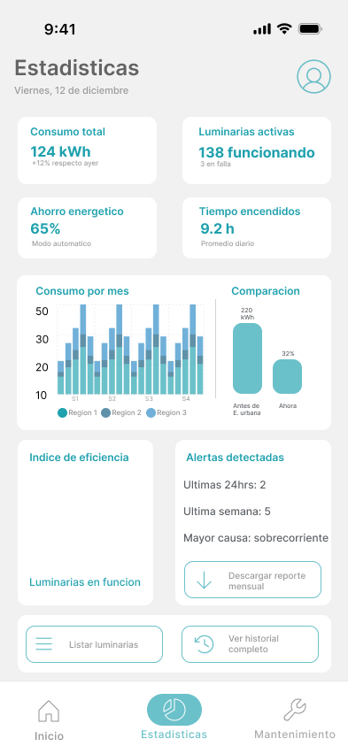

### **Descripción**
Módulo analítico con gráficas interactivas de rendimiento energético.

### **Incluye**
- Comparativa de consumo  
- Gráfica de barras por zona  
- Porcentaje de eficiencia  
- Historial de fallas por mes  
 

---

# 5. **Mantenimiento**
### **Captura**
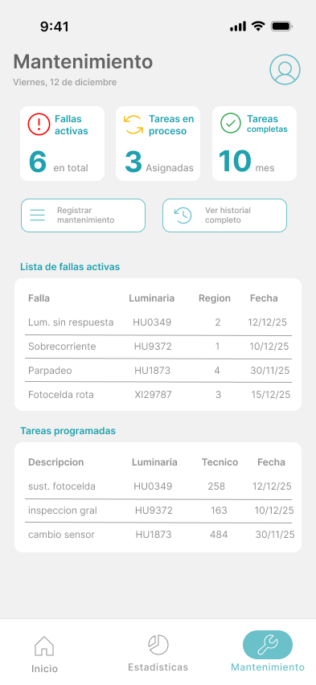

### **Descripción**
Pantalla para gestión integral del área técnica.

### **Componentes**
- Contadores operativos:
  - Tickets abiertos
  - Tickets en proceso
  - Tickets completados
- Lista segmentada por fecha
- Indicadores de urgencia por color
- Acceso a detalles del ticket

### **Objetivo**
✔ Mejorar logística operativa  
✔ Reducir tiempos de respuesta  

---

# 6. **Perfil de Usuario**
### **Captura**
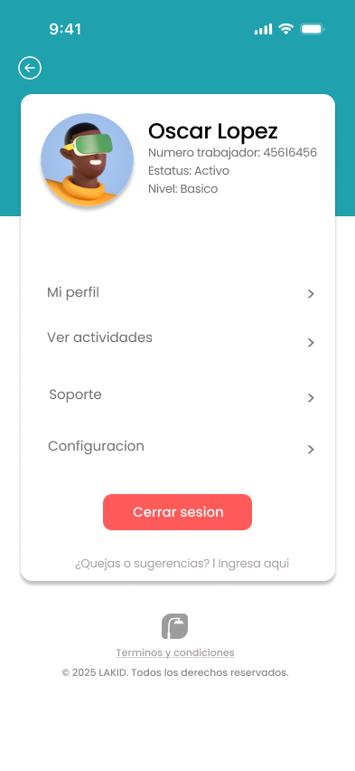

### **Elementos**
- Foto circular
- Información general
- Accesos:
  - Soporte
  - Configuración
  - Actividades
- Botón rojo “Cerrar sesión”

---

# 7. **Login con Google**
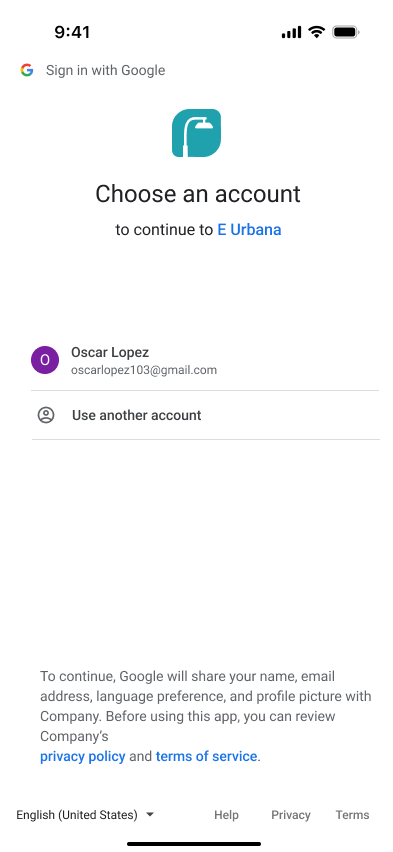

Pantalla estándar de Google para autenticación OAuth.

---

# 8. **Pantalla de Carga**
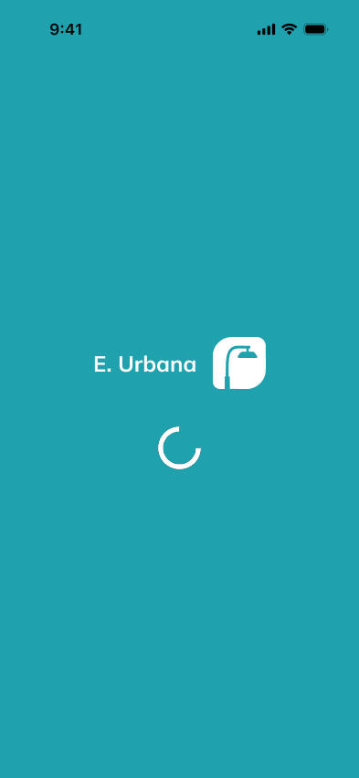

Indicador de procesos en segundo plano.

---

# 9. **Mapa de Luminarias**
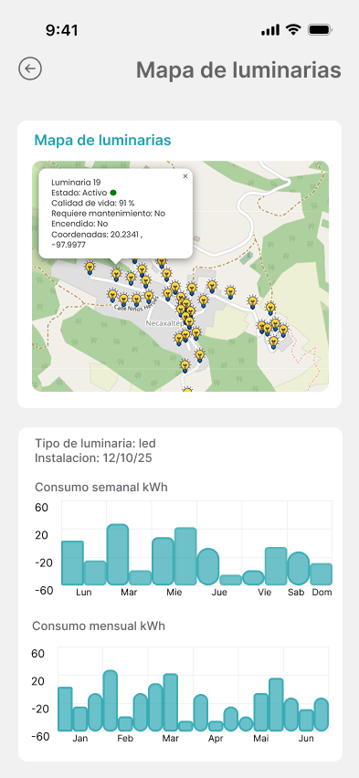

### **Componentes**
- Vista de mapa con marcadores
- Panel emergente con:
  - ID
  - Estado
  - Fecha de instalación
  - Lecturas
- Gráfica inferior por zona

---

# 10. **Generar Reporte**
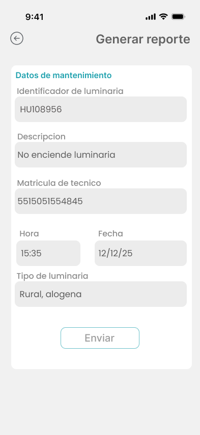

Formulario técnico completo para intervención operativa.

---

# 11. **Chat de Soporte**
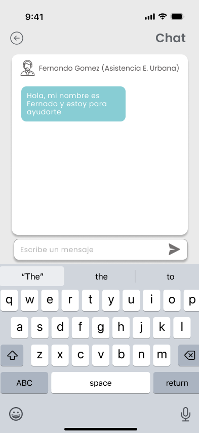

Mensajería entre técnicos y soporte urbano.

---

# 12. **Pantalla de Envío**
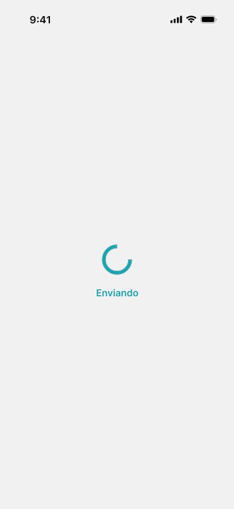

Confirmación visual de envío de reportes o mensajes.

---

# 🔁 **Flujo General de la Aplicación**
1. Splash  
2. Inicio de sesión  
3. Dashboard  
4. Navegación hacia:
   - Estadísticas  
   - Mantenimiento  
   - Mapa  
   - Perfil  
5. Reporte  
6. Chat  
7. Envío  
8. Cerrar sesión  

---

# 👨‍💻 **Créditos**
**Diseño y documentación UI/UX corporativa — E. Urbana**  
2025 · Sistema de Gestión Urbana Inteligente
