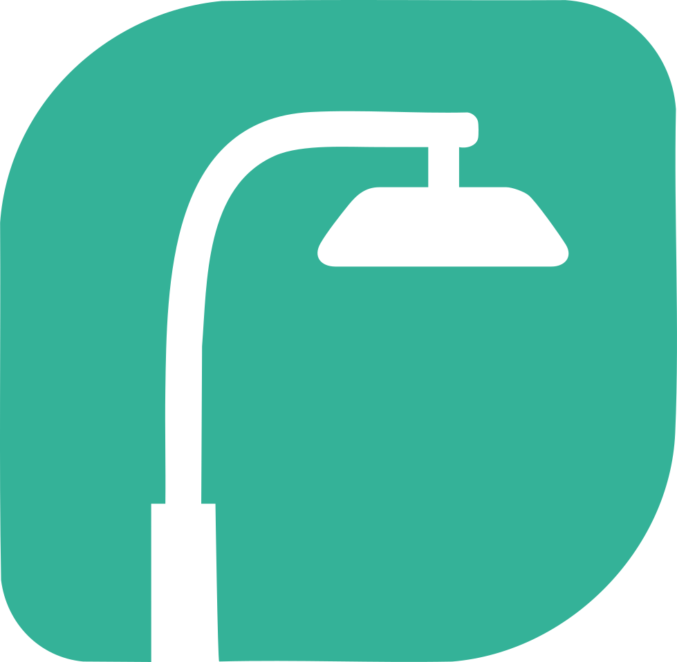
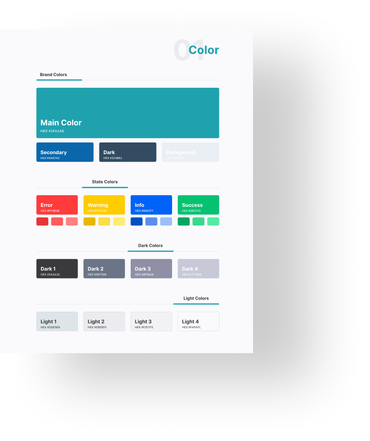
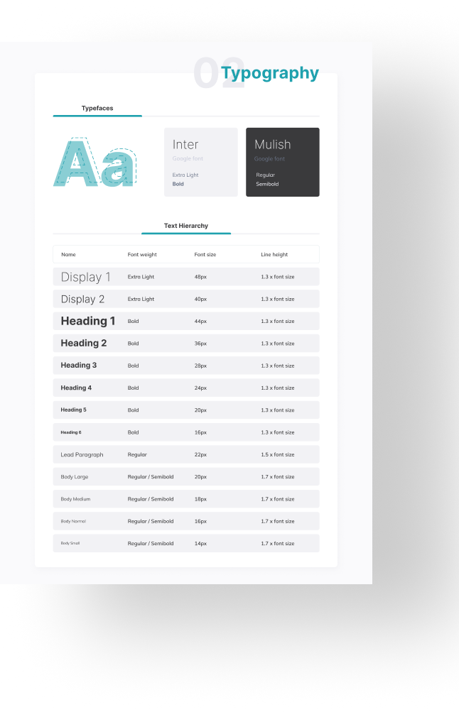
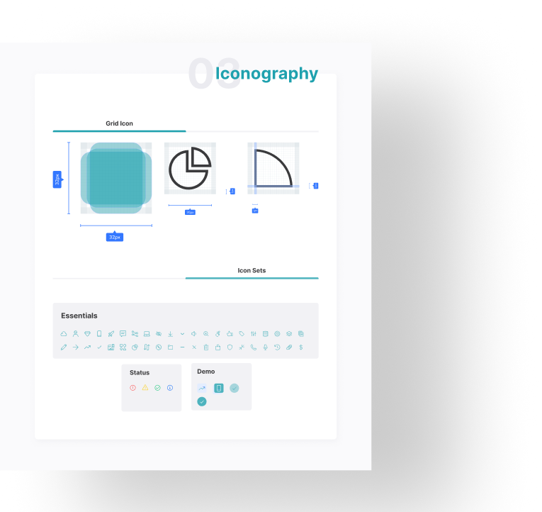

# E. Urbana — Style Guide

---

---

## **Tabla de Contenido**
1. [Introducción](#introducción)
2. [Identidad Visual](#identidad-visual)
   - [Logo](#logo)
   - [Principios de Marca](#principios-de-marca)
3. [Paleta de Colores](#paleta-de-colores)
4. [Tipografía](#tipografía)
5. [Iconografía](#iconografía)
6. [Guía de Uso](#guía-de-uso)
7. [Créditos](#créditos)

---

# **Introducción**

El **Style Guide de E. Urbana** establece los lineamientos visuales que garantizan uniformidad, coherencia e identidad en todos los elementos del ecosistema digital: web, móvil, dashboards y materiales institucionales.

Este documento reúne la esencia visual de la marca: colores, tipografías, iconos, logotipo y reglas de uso.

  

---

# **Identidad Visual**

## **Logo**

> _Icono principal de E. Urbana basado en una luminaria pública._

---

## **Principios de Marca**

- Minimalista  
- Tecnológica  
- Escalable  
- Clara y accesible  
- Inspirada en infraestructura urbana moderna  

---

# **Paleta de Colores**

El sistema de color define la atmósfera de la marca, inspirada en tecnología, eficiencia energética y entorno urbano moderno.

### **Colores Principales**
- **Main Color**: `#1FA1AE`  
- **Secondary Colors**: tonos de soporte para UI  
- **Background / Dark / Light Colors**

### **Colores de Estado**
- Error  
- Warning  
- Info  
- Success  

---

# **Tipografía**

La tipografía oficial del sistema es limpia, moderna y diseñada para garantizar legibilidad en interfaces digitales.

 

### **Fuentes**
- **Inter** — para textos funcionales y UI  
- **Mulish** — para encabezados, títulos y elementos destacados  

### **Jerarquía establecida**
- Display 1 / 2  
- Headings (1–6)  
- Párrafos principales  
- Body (Large / Medium / Small)  

---

# **Iconografía**

Los íconos están construidos sobre una cuadrícula geométrica y siguen un estilo coherente con las curvas y estructura del logotipo.

 

### **Características**
- Grid de construcción  
- Bordes redondeados  
- Simplicidad y claridad  
- Consistencia en estilo y grosor  

---

# **Guía de Uso**

Estas pautas ayudan a mantener la coherencia visual en cualquier proyecto donde participe E. Urbana.

### **Aplicaciones**
- Interfaces web (React + Chakra UI)  
- Dashboards administrativos  
- Apps móviles  
- Documentación interna  
- Material promocional  

### **Buenas Prácticas**
- Usar los colores tal como se definen en el sistema  
- Respetar jerarquías tipográficas  
- No distorsionar íconos o logotipos  
- Mantener accesibilidad y contraste adecuados  

---

# **Créditos**
**Diseño  UI/UX E. Urbana**  
Diseñado por: [luisivmaraz](https://github.com/luisivmaraz)

---

