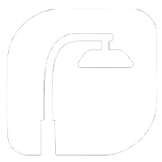
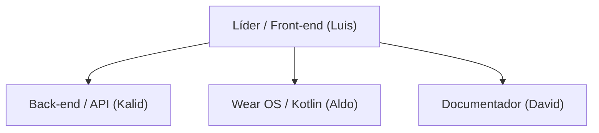
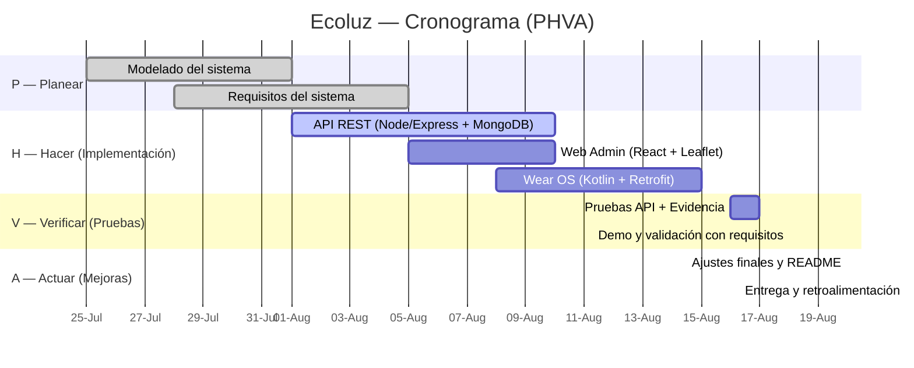

# ECOLUZ — MONITOREO INTELIGENTE DE LUMINARIAS PÚBLICAS

---

## Introducción
Ecoluz es un sistema de monitoreo para luminarias públicas que permite **detectar fallas**, **vigilar consumo** y **ubicar** cada punto de luz por **coordenadas GPS**. El proyecto integra:
- Una **API** para registrar/consultar el estado de las luminarias.
- Un **panel web** para administración, métricas y reportes.
- Un **wearable** para técnicos de campo que reciben alertas y confirman mantenimiento en sitio.

El objetivo es reducir tiempos de respuesta, mejorar la seguridad de las calles y optimizar el gasto energético municipal mediante analítica y automatización.

---

## Identidad Gráfica




---

## Descripción
Ecoluz centraliza la telemetría de luminarias (estado on/off, consumo estimado, ubicación, fecha de último servicio), ejecuta **ETL** para limpiar y normalizar datos y aplica **análisis supervisado y no supervisado** para detectar anomalías y proponer **rutas de mantenimiento**. El sistema expone endpoints REST para integrar proveedores externos y generar reportes periódicos para la administración pública.

---

## Planteamiento del problema
Las ciudades enfrentan:
- Falta de **visibilidad en tiempo real** del estado de las luminarias.
- **Reportes ciudadanos dispersos** y sin trazabilidad.
- **Rutas de mantenimiento ineficientes**, que incrementan costos.
- Pérdidas por **consumo anómalo** y robo/falla de componentes.

Esto genera **calles oscuras**, percepción de inseguridad, y **sobre costo** de operación.

---

## Propuesta de solución
**Arquitectura funcional y técnica (resumen):**
- **Sensores/Dispositivos** por luminaria → envían telemetría (estado, tensión, consumo, GPS) a la **API**.
- **API** (Node/Express o Python/FastAPI) → valida, almacena y expone endpoints de consulta y administración.

- **Análisis**:
  - **Supervisado**: predicción de falla, clasificación de anomalías.
  - **No supervisado**: clustering de zonas con alta incidencia.
- **Panel Web** (React/Vite) → tablero, mapas, alertas, KPIs, exportables.
- **Wear OS** (Kotlin) → notificaciones, checklists y cierre de OT en campo.
- **Disponibilidad**: contenedores, orquestación de jobs, backups.

**Puntos significativos:**
- Disminución de **MTTR** (tiempo medio de reparación).
- Priorización de mantenimiento por **impacto y riesgo**.
- Transparencia con **evidencia** (OT cerradas con geolocalización/foto).

---

## Objetivo General
Desarrollar e implantar una plataforma integral que **monitoree, diagnostique y optimice** el mantenimiento de luminarias públicas, mejorando la seguridad y reduciendo costos operativos.

---

## Objetivos Específicos
1. Implementar una **API segura** para ingestión y consulta de telemetría.
2. Diseñar un **proceso ETL reproducible** para limpieza y calidad de datos.
3. Construir **modelos analíticos** (supervisado y no supervisado) para detectar fallas y segmentar zonas.
4. Desplegar un **panel web** con mapas, APIs y generación de reportes.
5. Entregar un **wearable** para técnicos con flujo de trabajo en campo.


---

## Organigrama de Trabajo



---

##  Tabla de Colaboradores

| Foto | Nombre completo | Rol principal | GitHub | Correo |
|---|---|---|---|---|
|  | **Angel David Reyes Téllez** |   Documentación  | [@angelR003](https://github.com/usuario-github) | Seyersdolphin@outlook.com |
|   | **Luis Iván Márquez Azuara** | Frontend  | [@luisivmaraz ](https://github.com/luisivmaraz) | luisivmaraz03@gmail.com |
|  | **Brayn Kalid Reyes Silva** | backend| [@KalidRs ](https://github.com/KalidRs) | brayn4krs@gmail.com |
|  | **Aldo Tolentino Domingo** | Wear OS  | [@Aldotd12 ](https://github.com/Aldotd12) | tolentinodomingodiego@gmail.com |


---

## Diagrama de Gantt




---

##  Lista de Tecnologías

**Backend / API**
- **Node.js** + **Express**
- **MongoDB** + **Mongoose**
- **JWT** (autenticación y autorización)
- **Swagger /** (documentación de endpoints)
- **CORS** (seguridad)

**Base de Datos**
- **MongoDB Atlas** (gestión y hosting)
- Índices para consultas frecuentes
- Backups semanales

**Frontend Web (Administración)**
- **React** (con Vite)
- **React Router** (navegación)


**Wearable (Técnicos)**
- **Kotlin** · **Wear OS 3+**
- **Jetpack Compose for Wear OS**

---
##Objetos de alto valor

```mermaid
mindmap
  root((Ecoluz))
    "Luminarias Inteligentes"
      "Ubicación GPS"
      "Estado (encendida/falla)"
      "Consumo / lúmenes"
    "API REST (Node.js/Express)"
      "Autenticación JWT"
      "Endpoints: Consumo, Alertas, Luminarias"
    "Web Admin (React + Leaflet)"
      "Mapa interactivo"
      "Panel de alertas"
      "Reportes"
    "Wear OS (Kotlin)"
      "Alertas en campo"
      "Detalle de luminaria"
    "Base de Datos (MongoDB)"
      "Colección Luminarias"
      "Colección Consumo"
      "Usuarios/Roles"
    "Operaciones"
      "Detección de fallas"
      "Historial de mantenimiento"
      "Estadísticas"
```
