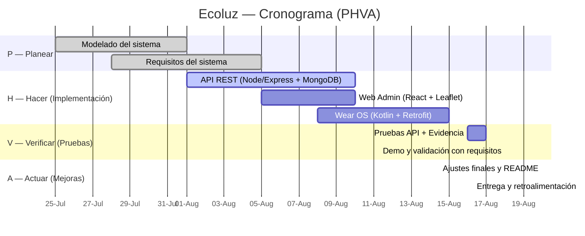

# 🚦 Deming EUrbana

## 🌍 ¿Qué es Deming EUrbana?

**Deming EUrbana** es una herramienta diseñada para facilitar la gestión, análisis y mejora continua de procesos urbanos, inspirada en los principios del ciclo de Deming (PHVA: Planificar, Hacer, Verificar, Actuar). Su objetivo principal es apoyar a equipos de trabajo, gestores urbanos y responsables de proyectos en la toma de decisiones basadas en datos, promoviendo la eficiencia y la optimización de recursos en entornos urbanos complejos (Luminarias).

### Características principales

- 📊 Integración de datos urbanos en tiempo real.
- 🗂️ Centralización de documentación y trazabilidad de acciones.
- 🤝 Herramientas colaborativas para equipos multidisciplinarios.
- 🔄 Automatización de tareas y generación de reportes personalizados.

## 🎯 ¿Para qué sirve?

- 🏙️ **Planificación urbana:** Permite estructurar proyectos y procesos urbanos siguiendo metodologías de mejora continua, asegurando la alineación con los objetivos estratégicos de la ciudad.
- 📈 **Seguimiento de indicadores:** Facilita el monitoreo de KPIs y resultados clave en tiempo real, permitiendo la detección temprana de desviaciones y oportunidades de mejora.
- 👥 **Gestión colaborativa:** Fomenta el trabajo en equipo y la comunicación entre diferentes actores del entorno urbano, integrando comentarios, asignación de tareas y seguimiento de responsabilidades.
- 📝 **Documentación y trazabilidad:** Centraliza la información relevante y el historial de acciones, facilitando auditorías, revisiones y la transferencia de conocimiento entre equipos.

## 🔄 Ciclo PHVA (PDCA) en detalle

Deming EUrbana implementa el ciclo PHVA (Planificar, Hacer, Verificar, Actuar) de la siguiente manera:

### 1. 📝 **Planificar (P)**
- 🎯 **Definición de objetivos:** Establece metas claras, medibles y alineadas con las necesidades urbanas.
- 🔍 **Identificación de problemas y oportunidades:** Analiza la situación actual mediante datos, diagnósticos y mapas interactivos.
- 🧩 **Diseño de estrategias y acciones:** Propone soluciones innovadoras, planifica actividades, recursos, responsables y plazos.
- 🏆 **Priorización:** Selecciona las acciones más relevantes según impacto, viabilidad y recursos disponibles.

### 2. 🚀 **Hacer (H)**
- 🛠️ **Implementación de acciones:** Ejecuta las actividades planificadas siguiendo un cronograma visual.
- 👤 **Asignación de tareas:** Distribuye responsabilidades entre los miembros del equipo, con notificaciones automáticas.
- 📅 **Registro de avances:** Documenta el progreso, cambios y lecciones aprendidas en tiempo real, con soporte multimedia.

### 3. 🔍 **Verificar (V)**
- 📊 **Monitoreo de resultados:** Evalúa el cumplimiento de los objetivos mediante indicadores, dashboards y KPIs personalizables.
- ⚖️ **Análisis de desviaciones:** Identifica diferencias entre lo planificado y lo ejecutado, generando alertas y recomendaciones.
- 📑 **Revisión de datos:** Utiliza herramientas de visualización, reportes automáticos y exportación de datos para facilitar la interpretación.

### 4. 🔄 **Actuar (A)**
- 🛠️ **Ajuste de procesos:** Propone mejoras y corrige desviaciones detectadas en la verificación, actualizando los planes de acción.
- 📚 **Estandarización de buenas prácticas:** Documenta y difunde los procesos exitosos para su replicabilidad.
- 💡 **Retroalimentación:** Integra los aprendizajes y sugerencias del equipo en la siguiente iteración del ciclo, promoviendo la mejora continua.

## 🌟 Ventajas

- ♻️ **Mejora continua:** Implementa el ciclo PDCA para optimizar procesos y resultados urbanos de manera sistemática.
- 🧠 **Toma de decisiones informada:** Proporciona herramientas avanzadas de análisis y visualización de datos para decisiones basadas en evidencia.
- ⏱️ **Ahorro de tiempo y recursos:** Automatiza tareas repetitivas, centraliza la información y reduce la carga administrativa.
- 📈 **Escalabilidad:** Adaptable a proyectos de diferentes tamaños, desde intervenciones locales hasta planes urbanos integrales.
- 🖥️ **Facilidad de uso:** Interfaz intuitiva, soporte técnico y documentación clara para usuarios de todos los niveles.
- 🔒 **Seguridad y privacidad:** Protección de datos sensibles y control de accesos por roles.

## 👥 ¿A quién está dirigido?

- 🏛️ Gestores y planificadores urbanos
- 🏢 Equipos de proyectos municipales y gubernamentales
- 🧑‍💼 Consultores en desarrollo urbano y sostenibilidad
- 🎓 Investigadores, académicos y estudiantes de urbanismo
- 🏗️ Empresas constructoras y desarrolladores inmobiliarios
- 🌱 Organizaciones de la sociedad civil interesadas en la mejora urbana

## 📚 Recursos adicionales

- [Repositorio de la organizacion](https://github.com/eurbana-dev)

---

##  Tabla de Colaboradores

| Foto | Nombre completo | Rol principal | GitHub | Correo |
|---|---|---|---|---|
| **Angel David Reyes Téllez** |  · Documentación ·  | [@angelR003](https://github.com/usuario-github) | Seyersdolphin@outlook.com |
| https://avatars.githubusercontent.com/u/147024614?v=4" width="48"> | **Luis Iván Márquez Azuara** | Frontend  | [@luisivmaraz ](https://github.com/luisivmaraz) | luisivmaraz03@gmail.com |
| https://avatars.githubusercontent.com/u/141973599?v=4 | **Brayn Kalid Reyes Silva** | backend| [@KalidRs ](https://github.com/KalidRs) | brayn4krs@gmail.com |
| https://avatars.githubusercontent.com/u/115129477?v=4 | **Aldo Tolentino Domingo** | Wear OS · I | [@Aldotd12 ](https://github.com/Aldotd12) | tolentinodomingodiego@gmail.com |

---

## Diagrama de Gantt

---

##  Lista de Tecnologías

**Backend / API**
- **Node.js** + **Express**
- **MongoDB** + **Mongoose**
- **JWT** (autenticación y autorización)
- **Swagger /** (documentación de endpoints)
- **CORS** (seguridad)

**Base de Datos**
- **MongoDB Atlas** (gestión y hosting)
- Índices para consultas frecuentes
- Backups semanales

**Frontend Web (Administración)**
- **React** (con Vite)
- **React Router** (navegación)

**Wearable (Técnicos)**
- **Kotlin** · **Wear OS 3+**
- **Jetpack Compose for Wear OS**

---
